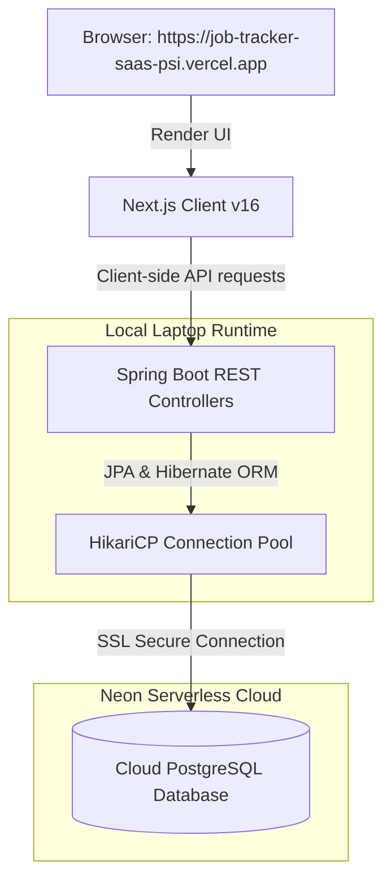

# 💼 CareerSuite: Smart Full-Stack Job Application Tracker

CareerSuite is a state-of-the-art, high-performance web application designed for university students to track, organize, and manage their internship and job applications with a stunning, premium SaaS dashboard interface.

---

## 🚀 Key Features

* **Premium Glassmorphic Workspace**: A visually stunning dark-mode layout featuring HSL-tailored color accents, futuristic glowing borders, custom scrollbars, and fluid animations.
* **Fluid Drag-and-Drop Kanban Board**: Custom zero-dependency HTML5 drag-and-drop mechanism engineered in React 19. Utilizes **Optimistic UI Updates** to instantly change status positions on the board, with automatic state rollback on database connection failures.
* **Top Performance Metrics**: Real-time calculated counters displaying:
  * **Total Applications**: Volume of applications tracked.
  * **Active Interviews**: Ongoing schedules in "Interviewing".
  * **Offers Secured**: Successful conversions.
  * **Rejections**: Closed pipelines.
  * **Offer Conversion Rate**: Direct success percentage metrics.
* **Interactive Modal Drawers**: Immersive panels to inspect recruiters' contact details (with a copy-email quick helper) and job vacancy links.
* **Inline Notes & Prep Editor**: Embedded rich text area within details drawers to draft interview preparation checklists, write target technologies, and keep behavioral notes.
* **Instant Searching & Query Filters**: High-performance linear searching matching job title/company, alongside workplace format filtering (Remote, Hybrid, Onsite) and sorting (Newest, Salary allowance, Interview Date).

---

## 🛠️ Technology Stack

| Layer | Technology | Version | Purpose |
| :--- | :--- | :--- | :--- |
| **Frontend** | **Next.js (App Router)** | `16.2.x` | Client meta-framework |
| | **React** | `19.2.x` | Component UI library |
| | **Tailwind CSS** | `4.x` | CSS-first styling & theme engine |
| | **Lucide Icons** | `0.x` | Vector SVG iconography |
| **Backend** | **Spring Boot** | `4.0.x` | RESTful API MVC microservice |
| | **Java JDK** | `25` | Language engine & compiler |
| | **Spring Data JPA** | `4.0.x` | Object-Relational mapping repository |
| | **Hibernate** | `7.x` | Database schema synchronizer |
| | **HikariCP** | `x.x` | High-speed connection pool |
| **Database** | **PostgreSQL** | `18` | Persistent relational storage |
| | **Neon Database** | - | Serverless PostgreSQL cloud hosting |
| **Deployment**| **Vercel** | - | Serverless Client Hosting & CI/CD |

---

## 📐 System Architecture Diagram



---

## 💻 Local Quickstart Guide

### 1. Database Configuration
Make sure your connection string is configured inside `backend/src/main/resources/application.properties`:
```properties
spring.datasource.url=jdbc:postgresql://<NEON_HOST>/neondb?sslmode=require
spring.datasource.username=<NEON_USERNAME>
spring.datasource.password=<NEON_PASSWORD>
spring.datasource.driver-class-name=org.postgresql.Driver
```

### 2. Launching the Spring Boot Backend
Navigate to the `backend` directory and start the application using the Maven wrapper:
```bash
cd backend
./mvnw spring-boot:run
```
*The REST server will initialize on port `8080` and automatically synchronize schemas.*

### 3. Launching the Next.js Frontend
In a new terminal shell, navigate to the `frontend` folder and run the development server:
```bash
cd frontend
npm run dev
```
*Open `http://localhost:3000` in your web browser.*

---

## ☁️ Deployment Architecture

* **Frontend Hosting (Vercel)**: Connects directly with your GitHub repository. Triggers automatic builds (`npm run build`) and live production deployments upon Git pushes (`git push`).
* **Database (Neon Serverless)**: Fully managed, cardless serverless PostgreSQL running in the AWS cloud with secure automatic backups.
